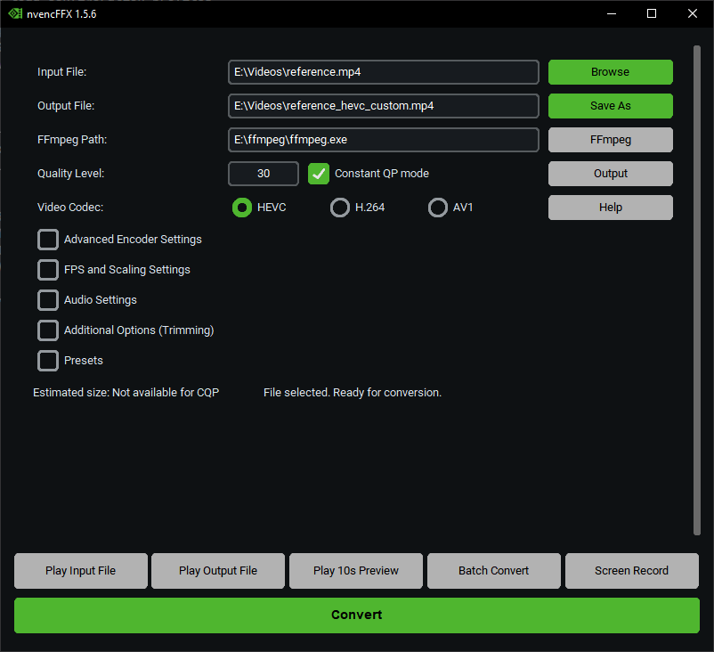

# nvencFF Toolbox 🚀

## Table of Contents
- [About the Project](#about-the-project)
- [Features](#features)
- [Getting Started](#getting-started)
  - [Prerequisites](#prerequisites)
  - [Installation](#installation)
  - [Building Executable (For Developers)](#building-executable-for-developers)
- [Usage](#usage)
- [Contributing](#contributing)

---

## About The Project

The **nvencFF Toolbox** is a convenient graphical user interface (GUI) application designed to simplify video processing tasks using **FFmpeg** and leveraging **NVIDIA's NVENC hardware encoder**.

This project was primarily developed to explore the capabilities of FFmpeg and NVIDIA's hardware encoders, resulting in a user-friendly tool that streamlines common video manipulation workflows, such as encoding and trimming.

---

## Features 🎥

* **Intuitive GUI:** Easy-to-use interface built with `customtkinter` for a smooth user experience.
* **FFmpeg Integration:** Seamlessly integrates with FFmpeg for powerful video and audio processing.
* **NVIDIA NVENC Support:** Utilizes NVIDIA's NVENC for high-performance, hardware-accelerated video encoding.
* **Video Trimming:** Easily trim video segments by specifying start and end times (HH:MM:SS format).
* **Additional Options:** Flexibility to add custom FFmpeg commands for advanced users.
* **Drag-and-Drop Support:** Conveniently add input files by dragging them into the application window.


---

## Getting Started

### Prerequisites

To use the nvencFF Toolbox, you will need:

* **Windows Operating System:** The application is built for Windows 10/11.
* **FFmpeg:** You need to have FFmpeg installed on your system and its executable (`ffmpeg.exe`) accessible in your system's PATH, or specify its path within the application.
* **NVIDIA GPU with NVENC Support:** For hardware-accelerated encoding, an NVIDIA graphics card with NVENC capabilities is required. Ensure you have the latest NVIDIA drivers installed.

### Installation

#### 1. Download the Executable (Recommended) 🚀

The easiest way to get started is to download the latest release executable (`.exe`) from the [Releases](https://gitlab.com/hadoukez/nvencFF-Toolbox/-/releases) page.

1.  Go to the [Releases](https://gitlab.com/hadoukez/nvencFF-Toolbox/-/releases) section of this GitLab repository.
2.  Download the `nvencFF_Toolbox.exe` file.
3.  Run the executable.

#### 2. Run from Source (For Developers) 🔧

If you want to run the application from its Python source code:

1.  **Clone the repository:**
    ```
    git clone [https://gitlab.com/hadoukez/nvencFF-Toolbox.git](https://gitlab.com/hadoukez/nvencFF-Toolbox.git)
    cd nvencFF-Toolbox
    ```
2.  **Install dependencies:**
    The project uses `customtkinter`, `CTkToolTip`, `pywin32` (for `win32gui`, `win32con`, `win32api`).
    ```bash
    pip install customtkinter CTkToolTip pywin32
    ```
3.  **Run the application:**
    ```
    python "nvencFF Toolbox.py"
    ```

### Building Executable (For Developers) 🔧

You can compile the Python script into a standalone Windows executable (`.exe`) using **Nuitka**.

1.  **Install Nuitka:**
    ```
    pip install nuitka
    ```
2.  **Build the executable:**
    Navigate to the project's root directory in your terminal and run the following command. This command configures Nuitka to create a standalone, single-file executable with disabled console mode, include necessary packages, set application metadata, and specify an icon.

    ```
    nuitka --msvc=latest --standalone --onefile --windows-console-mode=disable ^
    --include-package=customtkinter --enable-plugin=tk-inter ^
    --windows-icon-from-ico="icon.ico" ^
    --include-data-file=icon.ico=./ ^
    --product-name="nvencFF Toolbox" ^
    --product-version="1.0.2.1" ^
    --file-version="1.0.2.1" ^
    --file-description="nvencFF Toolbox" ^
    --company-name="Deepseek Enjoyer" ^
    --copyright="Copyright (C) 2025 hadouken" ^
    --output-dir=build "nvencFF Toolbox.py"
    ```
    The compiled executable will be found in the `build` directory specified by `--output-dir`.

---

## Usage 🎥

1.  **Launch the application:** Run the `.exe` file or `nvencFF Toolbox.py`.
2.  **Select Input File:** Click the "Browse Input" button or drag and drop your video file into the designated area.
3.  **Specify Output File:** Click "Browse Output" to choose where to save your processed video and what to name it.
4.  **Configure Options:**
    * **Trim Video:** Enter the `Start Time` and `End Time` in `HH:MM:SS` format to trim your video.
    * **Encoder:** Select your desired video encoder (e.g., `hevc_nvenc`, `h264_nvenc`, `av1_nvenc`).
    * **Additional FFmpeg Options:** Add any extra FFmpeg commands you need (e.g., `-aq-strength 8; -cq 0; -bf 0 or -bf 4; -intra-refresh 1; -forced-idr 1`).
5.  **Start Processing:** Click the "Convert" button to begin the video encoding.
6.  **Monitor Progress:** The console output within the application will show the FFmpeg progress.

---

##  Easy access via Windows "Send to" context menu 📁


1. Press **Win+R**, type:
   ```
   %APPDATA%\Microsoft\Windows\SendTo
   ```
2. Modify APP_PATH in "Send to nvencFF Toolbox.bat" script and create shortcut to it here.
3. You can rename it and set custom icon.

---

## Contributing

If you have a suggestion that would make this better, you can simply open an issue with the tag "enhancement" or "bug".

