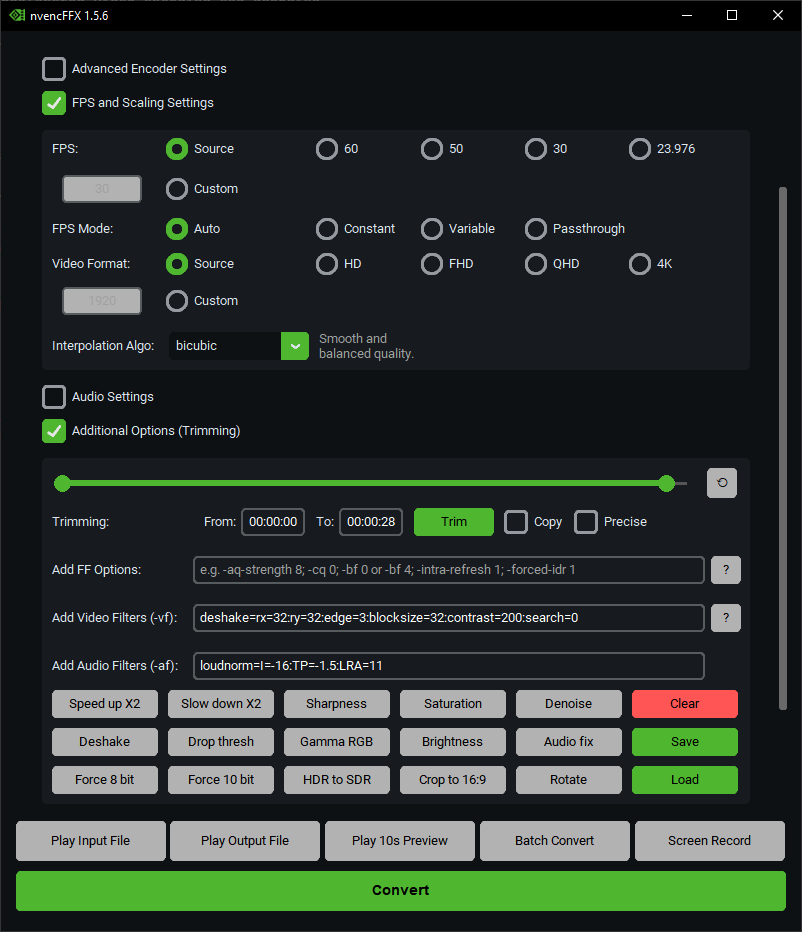

# nvencFFX 🚀

The **nvencFFX** is a convenient graphical user interface (GUI) application designed to simplify video processing tasks using **FFmpeg** and leveraging **NVIDIA's NVENC hardware encoder**.

This project was primarily developed to explore the capabilities of FFmpeg and NVIDIA's hardware encoders, resulting in a user-friendly tool that streamlines common video manipulation workflows, such as encoding and trimming.

---

## Features 🎥

* **Intuitive GUI:** Easy-to-use interface built with `customtkinter` for a smooth user experience.
* **FFmpeg Integration:** Seamlessly integrates with FFmpeg for powerful video and audio processing.
* **NVIDIA NVENC Support:** Utilizes NVIDIA's NVENC for high-performance, hardware-accelerated video encoding.
* **Video Trimming:** Easily trim video segments by specifying start and end times (HH:MM:SS format).
* **Batch Conversion:** Process multiple video files in one go with the same settings - perfect for converting entire folders of videos.
* **Screen Recording:** Record your screen directly with NVENC encoding - choose frame rate, codec, and quality settings.
* **Additional Options:** Flexibility to add custom FFmpeg commands for advanced users.
* **Drag-and-Drop Support:** Conveniently add input files by dragging them into the application window.



---

## Getting Started

### Prerequisites

To use the nvencFFX, you will need:

* **Windows Operating System:** The application is built for Windows 10/11.
* **FFmpeg:** You need to have FFmpeg installed on your system and its executable (`ffmpeg.exe`) accessible in your system's PATH, or specify its path within the application.
FFmpeg Windows builds links: [Windows builds from gyan.dev](https://www.gyan.dev/ffmpeg/builds/) or [Windows builds by BtbN](https://github.com/BtbN/FFmpeg-Builds/releases)
* **NVIDIA GPU with NVENC Support:** For hardware-accelerated encoding, an NVIDIA graphics card with NVENC capabilities is required. Ensure you have the latest NVIDIA drivers installed.

### Installation

#### 1. Download the Executable (Recommended) 🚀

The easiest way to get started is to download the latest release executable (`.exe`) from the [Releases](https://gitlab.com/hadoukez/nvencFFX/-/releases) page.

1.  Go to the [Releases](https://gitlab.com/hadoukez/nvencFFX/-/releases) section of this GitLab repository.
2.  Download the `nvencFFX.exe` file.
3.  Run the executable.

#### 2. Run from Source (For Developers) 🔧

If you want to run the application from its Python source code:

1.  **Clone the repository:**
    ```
    git clone https://gitlab.com/hadoukez/nvencFFX.git
    cd nvencFFX
    ```
2.  **Install dependencies:**
    The project uses `customtkinter`, `pillow`, `pywin32` (for `win32gui`, `win32con`, `win32api`).
    ```bash
    pip install customtkinter pillow pywin32
    ```
3.  **Run the application:**
    ```
    python "nvencFFX.py"
    ```

### Building Executable (For Developers) 🔧

You can compile the Python script into a standalone Windows executable (`.exe`) using **Nuitka**.

1.  **Install Nuitka:**
    ```
    pip install nuitka
    ```
2.  **Build the executable:**
    Navigate to the project's root directory in your terminal and run the following command. This command configures Nuitka to create a standalone, single-file executable with disabled console mode, include necessary packages, set application metadata, and specify an icon.

    ```
        python -m nuitka --msvc=latest --lto=yes ^
        --standalone --windows-console-mode=disable ^
        --include-package=customtkinter --enable-plugin=tk-inter ^
        --windows-icon-from-ico="nff.ico" ^
        --include-data-file=nff.ico=./ ^
        --include-data-file=nff-help.txt=./nff-help.txt ^
        --include-data-file=nff-about.txt=./nff-about.txt ^
        --include-data-file=nff-license.txt=./nff-license.txt ^
        --include-data-file=LICENSE.txt=./LICENSE.txt ^
        --product-name="nvencFFX" ^
        --product-version="1.6.4" ^
        --file-version="1.6.4" ^
        --file-description="nvencFFX" ^
        --company-name="Deepseek Enjoyer" ^
        --copyright="Copyright (C) 2026 hadouken" ^
        --output-dir=build "nvencFFX.py"
    ```
    The compiled executable will be found in the `build` directory specified by `--output-dir`.

---

## Usage 🎥

1.  **Launch the application:** Run the `.exe` file or `nvencFFX.py`.
2.  **Select Input File:** Click the "Browse Input" button or drag and drop your video file into the designated area.
3.  **Specify Output File:** Click "Browse Output" to choose where to save your processed video and what to name it.
4.  **Configure Options:**
    * **Trim Video:** Enter the `Start Time` and `End Time` in `HH:MM:SS` format to trim your video.
    * **Encoder:** Select your desired video encoder (e.g., `hevc_nvenc`, `h264_nvenc`, `av1_nvenc`).
    * **Additional FFmpeg Options:** Add any extra FFmpeg commands you need (e.g., `-aq-strength 8; -cq 0; -bf 0 or -bf 4; -intra-refresh 1; -forced-idr 1`).
5.  **Start Processing:** Click the "Convert" button to begin the video encoding.
6.  **Monitor Progress:** The console output within the application will show the FFmpeg progress.

---

##  Easy access via Windows "Send to" context menu 📁


1. Press **Win+R**, type:
   ```
   %APPDATA%\Microsoft\Windows\SendTo
   ```
2. Modify APP_PATH in "Send to nvencFFX.bat" script and create shortcut to it here.
3. You can rename it and set custom icon.

---

## Contributing

If you have a suggestion that would make this better, you can simply open an issue with the tag "enhancement" or "bug".

## Notes

- This app is designed for NVIDIA GPUs that support **NVENC hardware encoding**.
- For AMD GPUs use [RedFFmpegatron](https://gitlab.com/hadoukez/redffmpegatron).
- For Intel Arc GPUs and integrated graphics use [QuickFFSync](https://gitlab.com/hadoukez/quickffsync).
- The tool is intended for Windows only.

## License

nvencFFX is licensed under the MIT License — Modified for nvencFFX.

© 2026 hadouken (GitLab) / hadoooooouken (GitHub)

You are free to use, copy, modify, merge, publish, distribute, sublicense,
and/or sell copies of this software, **provided that**:

1. The above copyright notice and this permission notice are included in
   all copies or substantial portions of the software.
2. Any public fork, mirror, or redistribution must include a clear reference
   to the original repository: https://gitlab.com/hadoukez/nvencffx
3. The name "nvencFFX", "hadouken", or "hadoooooouken" may not be used to
   endorse or promote derivative products without explicit written permission.

THE SOFTWARE IS PROVIDED "AS IS", WITHOUT WARRANTY OF ANY KIND.

The release packages include FFmpeg binaries built by BtbN
https://github.com/BtbN/FFmpeg-Builds,
which are based on the official FFmpeg project and licensed under GPLv2/LGPLv2.1.
See included license files in the release archives.